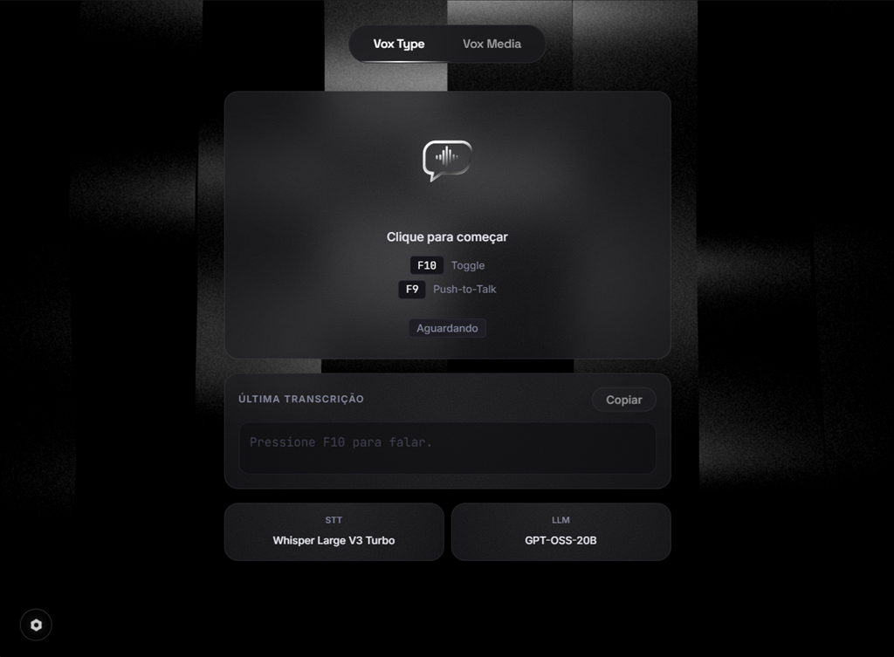

<div align="center">


# Vox

**Precision voice dictation, directly at your active cursor**

[](README.md)
[](README.en.md)

[](https://electronjs.org)
[](https://react.dev)
[](https://typescriptlang.org)
[](https://groq.com)
[](https://electronjs.org)
[](LICENSE)

</div>

---

<div align="center">
  
</div>

<br />

## ◈ What is Vox

**Vox** is a cross-platform (Windows, macOS, Linux) AI-powered voice dictation assistant built with Electron. It stays silently in your system tray and, when triggered via global shortcut (`F9`/`F10`) or by saying the wake word (**"Vox"**), records your speech, automatically stops when silence is detected, transcribes via **Whisper Large V3 Turbo**, automatically fixes punctuation and spelling using LLM, and injects the text **directly into the active cursor** of any application, with no special application support required.

> Think of it as an OS-level voice dictation: whether you are in VS Code, Word, a web form, or Slack, just say *"Vox"*, speak your text, and as soon as you stop talking, the text appears right where your cursor was focused.

> **Vox is an open-source alternative to [Wispr Flow](https://wisprflow.ai)**, featuring AI voice dictation, global shortcuts, hands-free voice commands, LLM correction pipelines, and text injection via native APIs.


---

## ◈ Comparison: Vox vs Wispr Flow

**Wispr Flow** is a commercial proprietary app that offers a restricted free plan (capped at a hard limit of 2,000 words per week) and paid monthly subscriptions ($9/mo to $29+/mo). **Vox** was built as an open, cross-platform alternative that is 100% free for daily use with providers like Groq (which offers a generous free tier with thousands of requests per day), focusing on privacy and user control.

### Comparison Table

| Feature / Characteristic | **Vox** | **Wispr Flow** |
|---|---|---|
| **License Model** | 100% Open-Source (MIT), Free | Proprietary / Commercial |
| **Free Plan / Cost** | 100% Free daily usage (via Groq API Free Tier) | Free limited to 2,000 words/week (Pro: $9 to $29+/mo) |
| **Wake Word (Voice Trigger)** | Yes, "Vox" (100% offline via ONNX) | Depends on shortcuts/cloud |
| **Privacy** | Audio processed via direct API, no middleman | Proprietary cloud processing |
| **Media Transcription (YouTube/Files)** | Yes (with export to SRT, VTT, TXT, MD, JSON) | Dictation focused only |
| **Platforms** | Windows (.exe), macOS (.dmg), and Linux (.AppImage) | Mac, Windows, iOS |
| **Auto-Stop on Silence (VAD)** | Yes, auto-stops and pastes on silence | Yes |

#### Vox Advantages

* **100% Free and Open-Source**: No recurring subscriptions, fully transparent and auditable codebase.
* **Virtually Unlimited & Free Daily Use**: By using providers like Groq API (which offer a generous free tier with thousands of requests per day), you can use Vox daily without word caps or weekly resets, unlike Wispr Flow's 2,000-word limit.
* **Offline Wake Word ("Vox")**: Activation keyword detection processed 100% locally on your PC via ONNX Runtime (< 1% CPU).
* **Integrated Media Tool**: Download and transcribe media from YouTube, TikTok, Instagram, and local files with subtitle export (.srt, .vtt).
* **Data Privacy**: Audio is sent directly to your preferred API provider without third-party retention for AI training.

#### Vox Disadvantages

* **Requires API Key**: Requires the user to enter their API Key in settings (e.g. obtained for free from Groq).
* **Fixed STT/LLM Models**: The API provider must support the project's default models (`whisper-large-v3-turbo` and `openai/gpt-oss-20b`).
* **Mobile Devices**: Currently focused on desktop operating systems (Windows, macOS, Linux), without a dedicated iOS/Android app.


---

## ◈ Use Cases

| Use Case | Description |
|---|---|
| **Voice Dictation** | Say *"Vox"* or use shortcuts to type into any application |
| **Media Transcription** | Transcribe videos from YouTube, TikTok, Instagram, or local files |
| **Subtitle Export** | Export transcriptions as `.srt`, `.vtt`, `.txt`, `.md`, `.json` |
| **Productivity** | Write emails, code, and documents hands-free |

---

## ◈ Features

```
◆  Real-time dictation via voice command ("Vox"), F9 (Push-to-Talk), or F10 (Toggle)
◆  Offline wake word detection ("Vox") via ONNX Runtime (< 1% CPU)
◆  Automatic recording stop when speech ends with instant active cursor injection
◆  Text injection into the active cursor of any window
◆  Transcription via Whisper Large V3 Turbo (Groq or any compatible provider)
◆  Automatic punctuation and spelling correction via LLM (openai/gpt-oss-20b)
◆  Floating Dock HUD with real-time Voice Activity Detection (VAD) visualizer
◆  Download and transcription of YouTube, TikTok, and Instagram videos
◆  Support for local media files (MP4, MP3, WAV, MKV, MOV, M4A...)
◆  Export in SRT, VTT, TXT, MD, JSON
◆  Autostart with OS
◆  System Tray background process (shortcuts and wake word work even when window is closed)
◆  Settings persisted in local SQLite
◆  Premium UI design with glassmorphism, animated beams, and micro-interactions
```

---

## ◈ Architecture

Vox follows standard Electron architecture separating **Main Process** (Node.js), **Renderer Process** (React), and **Preload** (secure IPC bridge).

```
+---------------------------------------------------------------+
|                        MAIN PROCESS                           |
|                       (electron/main.ts)                       |
|                                                                |
|  +----------+  +----------+  +----------+  +------------+    |
|  | Recorder |  |   STT    |  |Corrector |  |  Injector  |    |
|  | (VAD/WAV)|  | (Whisper)|  |  (LLM)   |  |(PowerShell)|    |
|  +----------+  +----------+  +----------+  +------------+    |
|                                                                |
|  +----------+  +----------+  +--------------------------+    |
|  |Downloader|  |    DB    |  |  GlobalShortcut (F9/F10)  |    |
|  | (yt-dlp) |  | (SQLite) |  |  + SystemTray             |    |
|  +----------+  +----------+  +--------------------------+    |
|                                                                |
|                    IPC (ipcMain / ipcRenderer)                 |
+----------------------------+-----------------------------------+
                             |
                +------------+-----------+
                |         PRELOAD         |
                |     (preload.ts)         |
                |  contextBridge / API     |
                +------------+-----------+
                             |
+----------------------------+-----------------------------------+
|                    RENDERER PROCESS                            |
|                                                                |
|  +---------------------------+  +---------------------------+ |
|  |      MainWindow            |  |        DockWindow          | |
|  |  (React + Framer Motion)   |  |  (Floating HUD, always-   | |
|  |                            |  |   on-top, showInactive)    | |
|  |  Tab: Voice Dictation      |  |  Real-time voice energy    | |
|  |  Tab: Media Transcription  |  |  visualizer                | |
|  |  Modal: Settings           |  +---------------------------+ |
|  +---------------------------+                                 |
|                     Zustand (Global State)                     |
+---------------------------------------------------------------+
```

---

## ◈ Main Process Modules

### `electron/main.ts`, Orchestrator
Main process entry point. Manages:
- Window creation and lifecycle (`MainWindow`, `DockWindow`)
- Global shortcuts registration (`F9`, `F10`)
- System tray icon to keep process active when main window is closed
- OS startup registration (`app.setLoginItemSettings`)
- Active window HWND capture prior to recording
- All IPC handlers (`ipcMain.handle`)

### `electron/modules/recorder.ts`, Audio Recorder
`AudioRecorder` extends `EventEmitter`. Receives PCM 16kHz mono chunks from renderer via IPC, calculates RMS energy for Voice Activity Detection (VAD Auto-Stop), and builds RIFF WAV buffers upon stopping.

```
PCM chunks (IPC) → RMS VAD → Buffer WAV (header + data)
```

### `electron/modules/stt.ts`, Speech-to-Text
Transcribes WAV buffers using the API provider (Groq API or compatible) with `whisper-large-v3-turbo`. Automatically detects WebM or WAV format and includes hallucination filtering.

```
Buffer WAV → FormData → API (Whisper V3 Turbo) → raw text
```

### `electron/modules/corrector.ts`, LLM Corrector
Passes transcribed text through an LLM via provider Chat API to fix punctuation, capitalization, and spelling without altering original language. Default model: `openai/gpt-oss-20b`.

```
raw text → LLM (strict system prompt) → revised text
```

### `electron/modules/injector.ts`, Text Injector
Injects text into active cursor of any application:

1. Copies text to clipboard (`clipboard.writeText`)
2. Waits 100ms
3. Restores focus to target window via `SetForegroundWindow(hwnd)`
4. Simulates `Ctrl+V` with `System.Windows.Forms.SendKeys::SendWait`

```
clipboard → SetForegroundWindow(hwnd) → SendWait('^v') → text at cursor
```

### `electron/modules/downloader.ts`, Media Downloader
Uses bundled `yt-dlp` binary to download audio from YouTube, TikTok, and Instagram URLs. Supports browser cookies (Chrome, Edge, Firefox, Brave).

```
URL → yt-dlp → local audio file → transcription
```

### `electron/modules/db.ts`, Persistence
SQLite database via `better-sqlite3`. Stores user settings (`apiKey`, shortcuts, cookies, wake word). Fallback to JSON if native module fails to load.

---

## ◈ UI & Design System

Vox features a custom design system built with React + Vanilla CSS inspired by glassmorphism and high-tech interfaces.

### Palette

```
Primary Background:   #0D0D0F (deep dark)
Surface:              rgba(255,255,255,0.04) with blur
Border:               rgba(255,255,255,0.08)
Primary Accent:       Pure White (#FFFFFF)
Secondary Text:       rgba(255,255,255,0.5)
Recording Highlight:  Emerald Green (#22c55e)
```

---

## ◈ Global Shortcuts

| Shortcut | Mode | Behavior |
|---|---|---|
| `F9` | Push-to-Talk | Hold to record, release to transcribe |
| `F10` | Toggle | Press once to start, press again to stop |

Shortcuts and wake word detection work even when all windows are closed because Vox remains active in the System Tray.

---

## ◈ Tech Stack

```
Runtime:         Electron 33 (Chromium + Node.js)
UI:              React 18 + TypeScript 5.7
Bundler:         electron-vite (Vite 5 for renderer)
Animations:      Framer Motion 12, GSAP 3, Three.js, @react-three/fiber
State:           Zustand 5
Database:        better-sqlite3 (Native SQLite)
Wake Word:       openWakeWord ONNX (onnxruntime-node)
STT:             Whisper Large V3 Turbo (via API provider)
LLM:             openai/gpt-oss-20b (via API provider)
Download:        yt-dlp (bundled binary)
Injection:       PowerShell + Win32 API (SetForegroundWindow, SendKeys)
Build:           electron-builder (Windows .exe, macOS .dmg, Linux .AppImage)
```

---

## ◈ Installation & Setup

### Prerequisites
- **Node.js** 20+
- **npm** 10+
- **Operating System**: Windows 10/11, macOS, or Linux

### Development

```bash
# Install dependencies
npm install

# Start development mode (hot-reload)
npm run dev
```

### Production Build

```bash
# Compile project
npm run build

# Package executables (generates Windows .exe, macOS .dmg, and Linux .AppImage)
npx electron-builder --win --mac --linux
# Output location: dist-build/
```

### Environment Variables (`.env`)

```env
GROQ_API_KEY=gsk_...          # API Key (provider must offer whisper-large-v3-turbo and openai/gpt-oss-20b)
```

---

## ◈ Available Settings

| Setting | Default | Description |
|---|---|---|
| API Key | N/A | Provider API Key (does not have to be Groq, as long as provider offers required models) |
| Wake Word | `Enabled ("Vox")` | Hands-free background voice activation for "Vox" |
| Sensitivity | `50%` | Detection sensitivity for "Vox" wake word |
| Toggle Shortcut | `F10` | Manually start/stop recording |
| Push-to-Talk | `F9` | Record while holding key |
| Browser Cookies | `chrome` | Choose browser (Chrome, Edge, Firefox, Brave, or None) for private media cookie extraction |
| STT Model | `whisper-large-v3-turbo` | Default STT model (must be supported by provider) |
| LLM Model | `openai/gpt-oss-20b` | Default LLM correction model (must be supported by provider) |

---

## ◈ Export Formats (Media Transcription)

| Format | Extension | Usage |
|---|---|---|
| Plain Text | `.txt` | Simple reading |
| Markdown | `.md` | Documentation |
| SubRip | `.srt` | Video player subtitles |
| WebVTT | `.vtt` | Web HTML5 subtitles |
| JSON | `.json` | Tool integrations |

---

## ◈ License

This project is licensed under the **MIT License**. See the [LICENSE](LICENSE) file for details.

```text
MIT License

Copyright (c) 2026 Cristóvão Carvalho

Permission is hereby granted, free of charge, to any person obtaining a copy
of this software and associated documentation files (the "Software"), to deal
in the Software without restriction, including without limitation the rights
to use, copy, modify, merge, publish, distribute, sublicense, and/or sell
copies of the Software, and to permit persons to whom the Software is
furnished to do so, subject to the following conditions:

The above copyright notice and this permission notice shall be included in all
copies or substantial portions of the Software.

THE SOFTWARE IS PROVIDED "AS IS", WITHOUT WARRANTY OF ANY KIND, EXPRESS OR
IMPLIED, INCLUDING BUT NOT LIMITED TO THE WARRANTIES OF MERCHANTABILITY,
FITNESS FOR A PARTICULAR PURPOSE AND NONINFRINGEMENT. IN NO EVENT SHALL THE
AUTHORS OR COPYRIGHT HOLDERS BE LIABLE FOR ANY CLAIM, DAMAGES OR OTHER
LIABILITY, WHETHER IN AN ACTION OF CONTRACT, TORT OR OTHERWISE, ARISING FROM,
OUT OF OR IN CONNECTION WITH THE SOFTWARE OR THE USE OR OTHER DEALINGS IN THE
SOFTWARE.
```

---

<div align="center">

Cristóvão Carvalho &nbsp;·&nbsp; **Vox**

</div>
